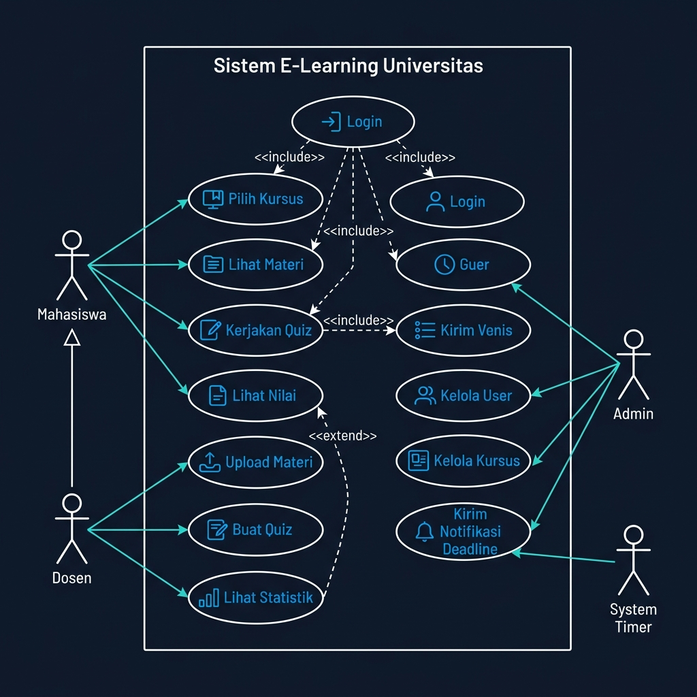
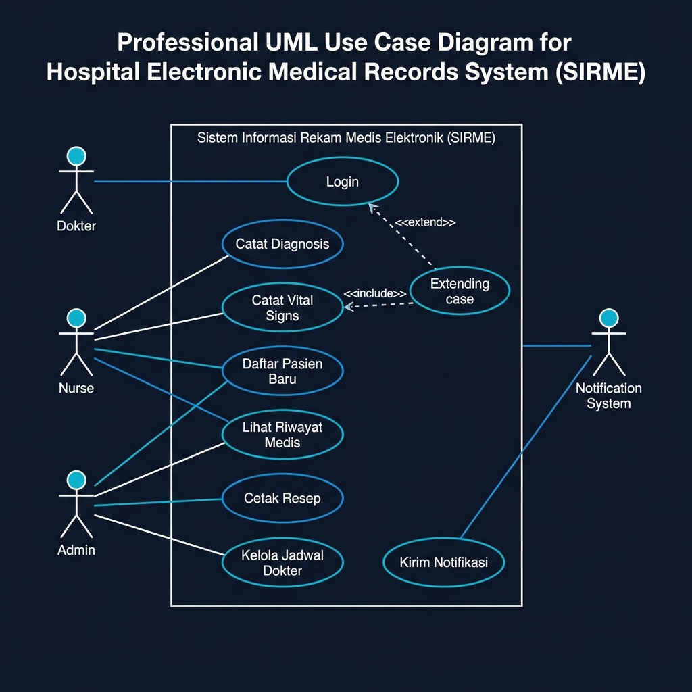
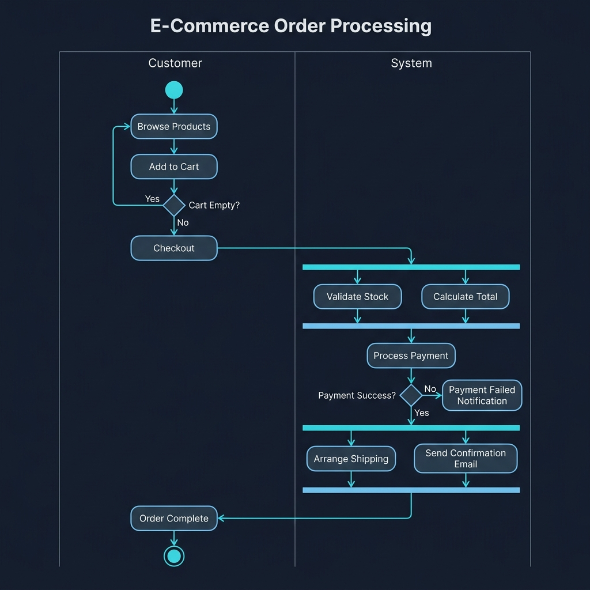
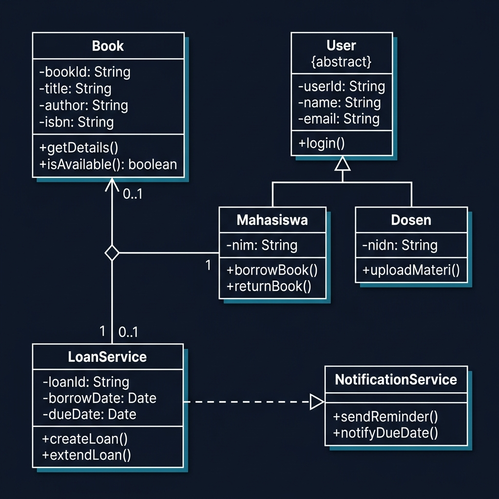
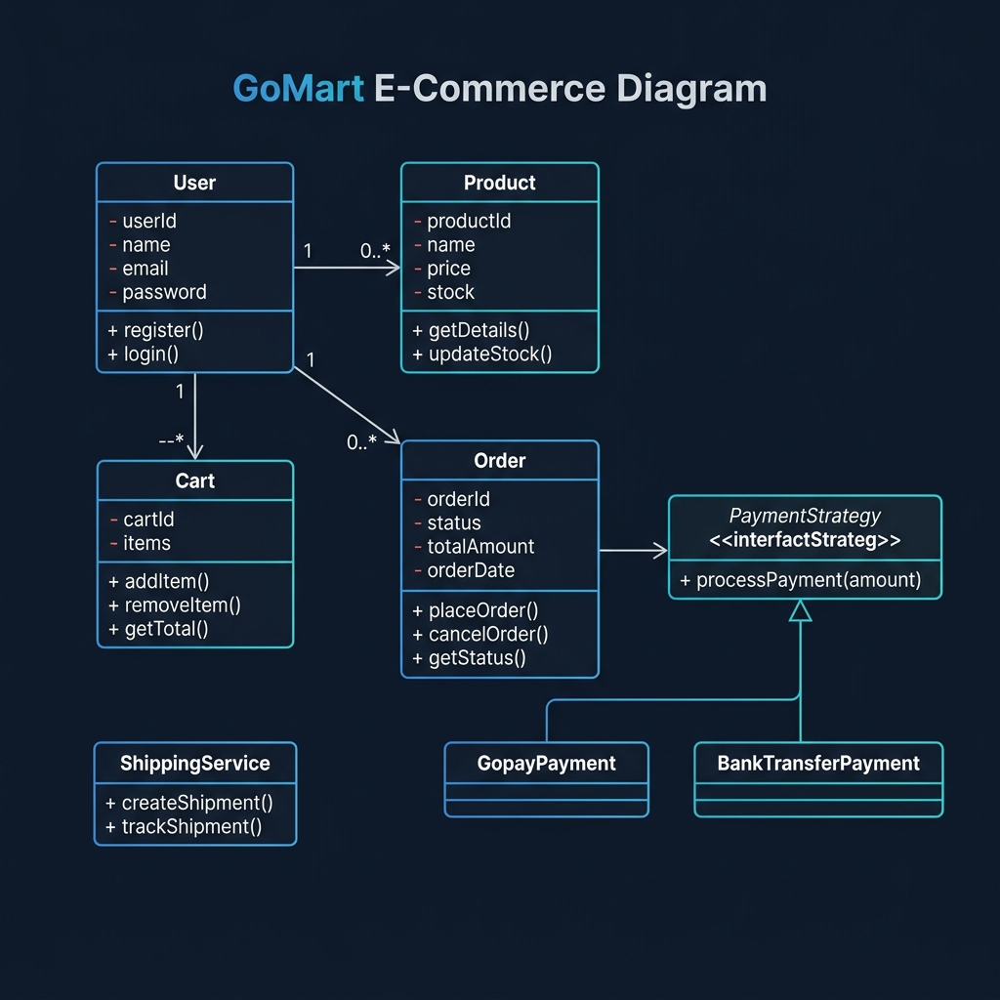
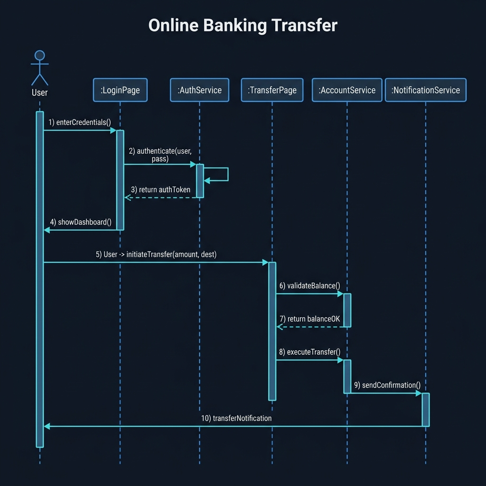
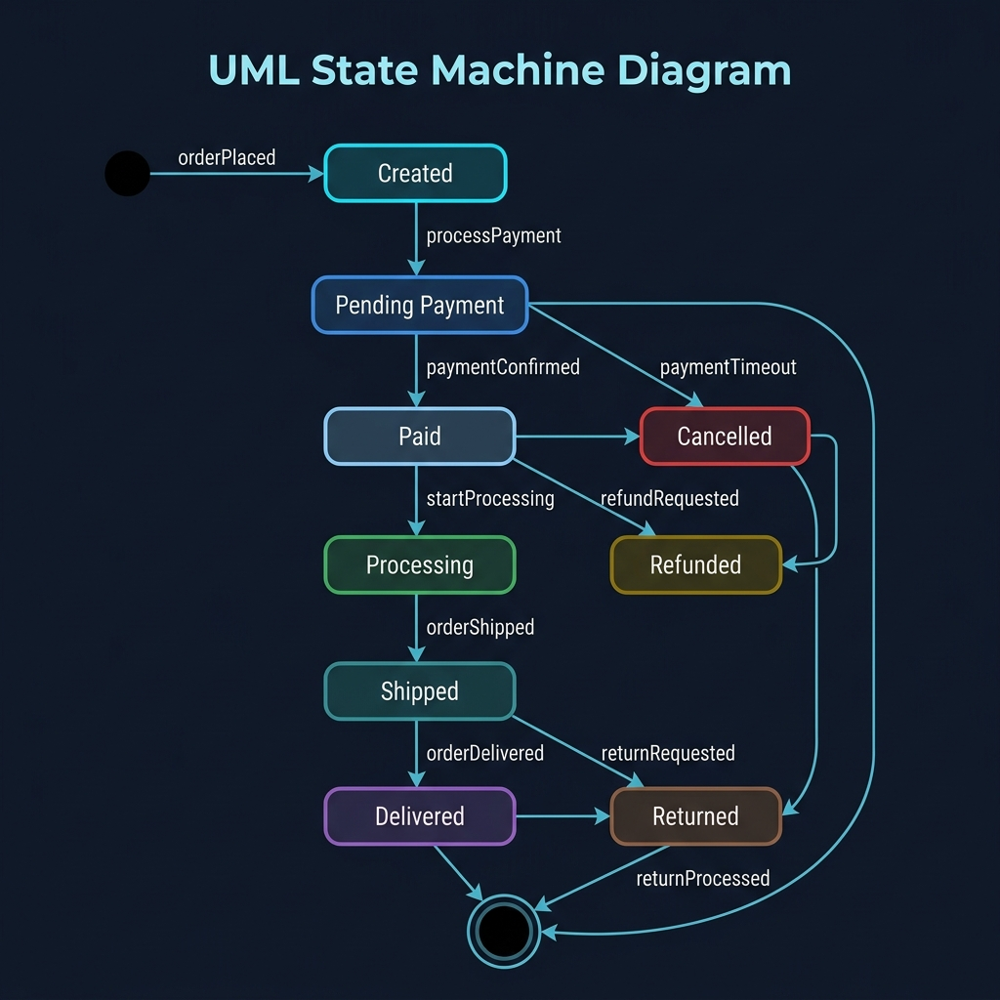
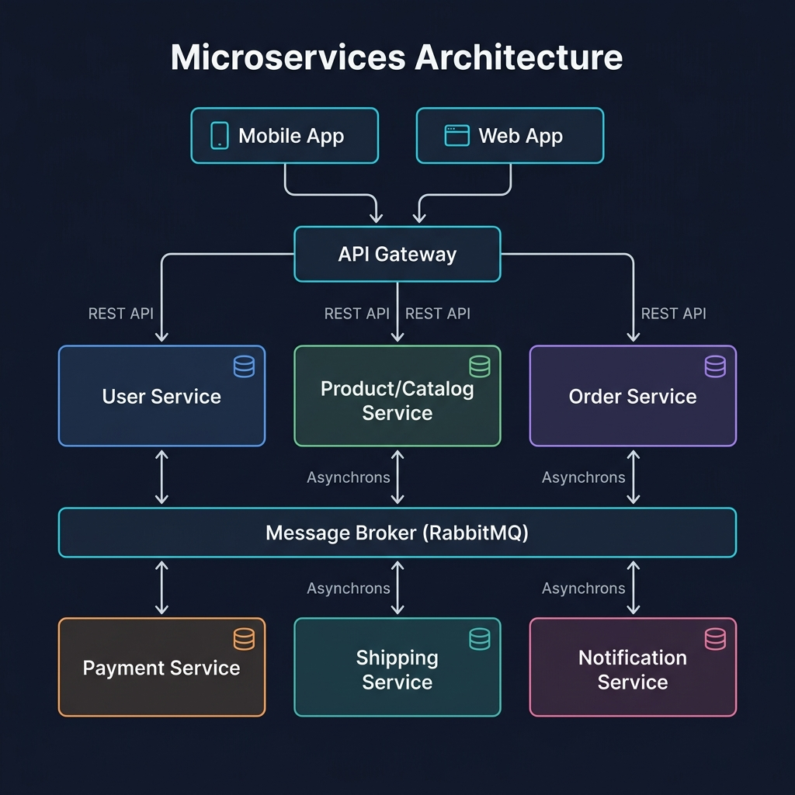

# 📘 KISI-KISI UTS SOFTWARE ENGINEERING - BINUS UNIVERSITY
## SEMESTER 4 — FORMAT: 5 SOAL CASE STUDY

---

# SOAL 1 (25%) — The Nature of Software & SE, Software Processes, Agile & Lean, Scrum

---

## 1.1 The Nature of Software and Software Engineering

### Definisi Software
Software adalah:
1. **Instructions (program komputer)** — memberikan fungsionalitas yang diinginkan
2. **Data structures** — memungkinkan program memanipulasi informasi
3. **Descriptive information** — dokumen hard copy dan virtual yang mendeskripsikan operasi dan penggunaan program

### Karakteristik Software (vs Hardware)
| Aspek | Software | Hardware |
|-------|----------|----------|
| Manufaktur | Dikembangkan/di-engineer | Di-manufaktur |
| Keausan | Tidak aus (wear out), tapi **deteriorate** | Aus seiring waktu |
| Komponen | Kebanyakan **custom-built** | Bisa menggunakan komponen standar |
| Kurva Failure | "Idealized" vs "Actual" curve | Bathtub curve |

### Software Failure Curve
- **Idealized curve**: failure rate tinggi di awal, lalu stabil rendah
- **Actual curve**: setiap kali ada perubahan/update, failure rate naik lagi (spike), dan baseline-nya perlahan naik → ini disebut **software deterioration**

### Kategori Software (7 Kategori)
1. **System Software** — OS, compiler, driver, utility
2. **Application Software** — standalone program untuk kebutuhan bisnis
3. **Engineering/Scientific Software** — CAD, simulasi, analisis numerik
4. **Embedded Software** — software dalam produk (microwave, mobil)
5. **Product-line Software** — software yang dijual sebagai produk (MS Office)
6. **Web/Mobile Applications** — aplikasi web dan mobile
7. **Artificial Intelligence Software** — expert systems, neural networks, ML

### Definisi Software Engineering
> "The application of a **systematic, disciplined, quantifiable** approach to the development, operation, and maintenance of software." — IEEE

### Software Engineering Layers (4 Layers)
```
        ┌─────────────┐
        │    Tools     │  ← alat bantu (IDE, testing tools)
        ├─────────────┤
        │   Methods    │  ← teknik (analysis, design, testing)
        ├─────────────┤
        │   Process    │  ← framework kegiatan SE
        ├─────────────┤
        │   Quality    │  ← fondasi, fokus pada kualitas
        └─────────────┘
```

### Software Engineering Practice (Essence of Practice)
1. **Understand the problem** — siapa stakeholder? apa unknowns? bisa di-decompose?
2. **Plan a solution** — pernah lihat masalah serupa? ada pola? 
3. **Carry out the plan** — apakah solusi sesuai rencana? review setiap komponen
4. **Examine the result** — testing, validasi terhadap requirement

---

## 1.2 Software Processes and Development Life Cycle Models

### Generic Process Framework
5 aktivitas framework:
1. **Communication** — kolaborasi dengan customer, requirement gathering
2. **Planning** — project plan, jadwal, risiko, resources
3. **Modeling** — analysis & design (membuat model/blueprint)
4. **Construction** — code generation & testing
5. **Deployment** — delivery, feedback dari customer

### Umbrella Activities
Aktivitas yang mendukung sepanjang proses:
- Software project tracking & control
- Risk management
- Software quality assurance
- Technical reviews
- Measurement
- Configuration management
- Reusability management
- Work product preparation & production

### Process Flow Types
1. **Linear Process Flow** → Communication → Planning → Modeling → Construction → Deployment (urut)
2. **Iterative Process Flow** → mengulang satu/beberapa aktivitas sebelum lanjut
3. **Evolutionary Process Flow** → circular, setiap putaran menghasilkan versi lebih lengkap
4. **Parallel Process Flow** → beberapa aktivitas berjalan bersamaan

### Prescriptive Process Models

#### A. Waterfall Model (Linear Sequential)
```
Communication → Planning → Modeling → Construction → Deployment
```
- **Kelebihan**: Simpel, mudah dipahami, cocok untuk requirement stabil
- **Kekurangan**: Tidak fleksibel, customer harus sabar, working software baru di akhir
- **Cocok untuk**: Proyek dengan requirement yang jelas dan tidak berubah

#### B. V-Model
```
Requirements ─────────────────────── Acceptance Testing
   Analysis ───────────────────── System Testing
      Design ─────────────── Integration Testing
         Coding ──────── Unit Testing
```
- Setiap fase development punya pasangan fase testing
- Menekankan **verification & validation** di setiap level

#### C. Incremental Model
- Menghasilkan software dalam **increments** (versi bertahap)
- Increment pertama = **core product** (fitur dasar)
- Setiap increment menambah fungsionalitas
- Cocok ketika staffing terbatas atau deadline ketat

#### D. Evolutionary Models

**Prototyping:**
- Membuat prototype cepat untuk klarifikasi requirement
- Customer evaluasi → refine → iterate
- **Bahaya**: prototype bisa jadi produk final tanpa kualitas

**Spiral Model (Boehm):**
- Menggabungkan iterative + systematic dari waterfall
- Setiap loop: **Planning → Risk Analysis → Engineering → Customer Evaluation**
- **Risk-driven** — sangat cocok untuk proyek besar berisiko tinggi
- Realistic untuk large-scale systems

#### E. Concurrent Development Model
- Semua aktivitas bisa terjadi bersamaan
- Menggunakan **state diagram** untuk setiap aktivitas
- Cocok untuk proyek client/server dan component-based

---

## 1.3 Agile Principle & Lean Foundations

### Manifesto for Agile Software Development (4 Values)
1. **Individuals and interactions** over processes and tools
2. **Working software** over comprehensive documentation
3. **Customer collaboration** over contract negotiation
4. **Responding to change** over following a plan

### 12 Prinsip Agile
1. Prioritas utama: memuaskan customer melalui **early & continuous delivery**
2. **Welcome changing requirements**, bahkan di tahap akhir
3. Deliver working software **frequently** (minggu-bulan, prefer lebih pendek)
4. Business people & developers harus **bekerja sama daily**
5. Bangun proyek di sekitar **motivated individuals**, berikan trust
6. **Face-to-face conversation** = metode komunikasi paling efektif
7. **Working software** = ukuran utama kemajuan
8. Agile mendukung **sustainable development** (pace konstan)
9. Perhatian pada **technical excellence & good design**
10. **Simplicity** — memaksimalkan pekerjaan yang TIDAK dilakukan
11. Tim yang **self-organizing** menghasilkan arsitektur/design terbaik
12. Tim **merefleksikan** cara menjadi lebih efektif secara berkala

### Agile vs Plan-Driven
| Aspek | Agile | Plan-Driven |
|-------|-------|-------------|
| Requirement | Berubah-ubah, unclear | Stabil, well-defined |
| Delivery | Incremental, frequent | Single delivery di akhir |
| Documentation | Minimal, essential | Komprehensif |
| Team | Small, co-located, skilled | Bisa besar, terdistribusi |
| Customer | Terlibat aktif terus | Terlibat di awal & akhir |

### Lean Software Development (7 Prinsip)
1. **Eliminate Waste** — hapus semua yang tidak menambah value
2. **Amplify Learning** — belajar dari feedback cepat
3. **Decide as Late as Possible** — keputusan saat info paling lengkap
4. **Deliver as Fast as Possible** — semakin cepat deliver, semakin cepat feedback
5. **Empower the Team** — berikan otoritas ke tim
6. **Build Integrity In** — kualitas dari awal, bukan testing di akhir
7. **See the Whole** — lihat sistem secara keseluruhan

---

## 1.4 Agile Frameworks (Selain Scrum)

Selain Scrum, ada metode Agile lain yang sering digunakan:

### 1. Kanban
Metodologi lean yang fokus pada *change management* dan *service delivery*. 6 Praktik Inti:
- **Visualizing workflow**: menggunakan Kanban board (To Do, Doing, Done)
- **Limiting WIP (Work in Progress)**: membatasi pekerjaan yang sedang berjalan agar fokus menyelesaikannya lebih cepat
- **Managing workflow**: menganalisis *bottleneck* (kendala) dan memperbaikinya
- **Making process policies explicit**: mendokumentasikan aturan kriteria "Done"
- **Focusing on continuous improvement**: loop *feedback* berbasis data
- **Make process changes collaboratively**: melibatkan semua anggota tim

### 2. eXtreme Programming (XP)
Fokus pada keunggulan teknis dari *development*. Fase-fasenya:
- **Planning**: berdasarkan *User Stories*, memperkirakan *cost*, mengatur rilis, dan menggunakan *Project Velocity*
- **Design**: mengikuti prinsip KIS (*Keep It Simple*), menggunakan purwarupa (*Spike solutions*), dan **Refactoring** (penyempurnaan desain berulang)
- **Coding**: menekankan *Unit Testing* sebelum coding, serta **Pair Programming** (pemrograman berpasangan)
- **Testing**: *Acceptance tests* didefinisikan oleh pengguna dan *unit tests* dieksekusi setiap hari

### 3. DevOps
Menggabungkan ranah *Development* dan *Operations* berlandaskan prinsip Agile dan Lean ke seluruh *supply chain* perangkat lunak. Tahap siklus DevOps:
- **Continuous Development**: memecah fungsi ke dalam banyak *sprint* untuk diserahkan ke tim QA / testing.
- **Continuous Testing**: pengujian *automated* dari iterasi fungsi untuk cegah *defect*.
- **Continuous Integration**: fungsionalitas baru digabungkan ke kode lama ke environment runtime dan dicek.
- **Continuous Deployment**: kode matang di-*(deploy)*/diinstal ke lingkungan *production*.
- **Continuous Monitoring**: memantau jalannya sistem secara proaktif sebelum ditemukan *error* oleh *user*.

---

## 1.5 Scrum Framework

### Scrum Roles
1. **Product Owner** — menentukan fitur, prioritas backlog, ROI, accept/reject work
2. **Scrum Master** — servant-leader, menghapus impediments, memastikan Scrum dijalankan
3. **Development Team** — cross-functional, self-organizing, 5-9 orang ideal

### Scrum Artifacts
1. **Product Backlog** — daftar semua fitur/requirement, diurutkan prioritas oleh PO
2. **Sprint Backlog** — subset product backlog yang dipilih untuk sprint tertentu
3. **Product Increment** — hasil kerja sprint yang "Done" dan potentially shippable

### Scrum Events/Ceremonies
1. **Sprint** — time-box 1-4 minggu, menghasilkan increment
2. **Sprint Planning** — tim menentukan apa yang akan dikerjakan & bagaimana
3. **Daily Scrum (Stand-up)** — 15 menit, 3 pertanyaan: apa yang dikerjakan kemarin? hari ini? ada hambatan?
4. **Sprint Review** — demo increment ke stakeholder, dapatkan feedback
5. **Sprint Retrospective** — tim refleksi: apa yang baik? apa yang perlu diperbaiki?

### User Stories (Format)
```
As a [role], I want [feature], so that [benefit]
```
**Contoh**: "As a student, I want to view my grades online, so that I can track my academic progress."

### Story Points & Velocity
- **Story Points**: estimasi relatif effort (Fibonacci: 1, 2, 3, 5, 8, 13, 21)
- **Velocity**: total story points yang diselesaikan per sprint
- Digunakan untuk planning sprint berikutnya

### Definition of Done (DoD)
Kriteria yang harus dipenuhi agar work item dianggap "Done":
- Code complete & reviewed
- Unit tests passed
- Integration tested
- Documentation updated
- Accepted by Product Owner

---

## CONTOH SOAL & JAWABAN — SOAL 1

### Case Study:
> PT TechnoVision ingin mengembangkan aplikasi **e-learning** untuk universitas. Requirement belum sepenuhnya jelas karena stakeholder dari berbagai fakultas memiliki kebutuhan berbeda. Tim development terdiri dari 7 orang developer berpengalaman. Budget terbatas dan deadline 6 bulan. Stakeholder ingin melihat progress secara berkala.

**Pertanyaan:**
1. Jelaskan mengapa Agile/Scrum lebih tepat dibanding Waterfall untuk proyek ini! (10 poin)
2. Rancang Scrum implementation untuk proyek ini termasuk roles, sprint planning, dan artifacts! (10 poin)
3. Bagaimana Lean principles dapat diterapkan untuk memaksimalkan value delivery? (5 poin)

**Jawaban:**

**1. Mengapa Agile/Scrum lebih tepat:**

Berdasarkan karakteristik proyek:
- **Requirement belum jelas** → Waterfall membutuhkan requirement lengkap di awal, sedangkan Agile **welcome changing requirements** (Prinsip Agile #2)
- **Stakeholder beragam** → Agile mendukung **customer collaboration** dan feedback berkala melalui Sprint Review
- **Tim 7 orang berpengalaman** → sesuai ukuran ideal Scrum team (5-9 orang), dan tim berpengalaman cocok untuk **self-organizing team** (Prinsip Agile #11)
- **Deadline 6 bulan** → dengan sprint 2 minggu, bisa ada ~12 sprint, memungkinkan **early & continuous delivery** (Prinsip Agile #1)
- **Stakeholder ingin lihat progress** → Sprint Review di setiap akhir sprint memenuhi kebutuhan ini
- Waterfall baru menghasilkan working software di akhir, berisiko tinggi jika requirement salah

**2. Scrum Implementation:**

**Roles:**
- **Product Owner**: Perwakilan universitas yang memahami kebutuhan semua fakultas, bertanggung jawab mengelola Product Backlog
- **Scrum Master**: Senior developer yang memahami Scrum, menghapus hambatan dan memfasilitasi proses
- **Development Team**: 5 developer (2 frontend, 2 backend, 1 QA/tester)

**Sprint Planning:**
- Sprint duration: **2 minggu** (12 sprint total dalam 6 bulan)
- Sprint 1-2: Setup infrastruktur + modul login/authentication (core product)
- Sprint 3-4: Modul manajemen kursus + upload materi
- Sprint 5-6: Modul quiz/assessment
- Sprint 7-8: Forum diskusi + notifikasi
- Sprint 9-10: Dashboard analytics + reporting
- Sprint 11-12: Polish, bug fixes, UAT

**Artifacts:**
- **Product Backlog**: Daftar semua fitur e-learning diprioritaskan menggunakan MoSCoW (Must/Should/Could/Won't)
- **Sprint Backlog**: User stories yang dipilih untuk sprint berjalan, di-break down menjadi tasks
- **Increment**: Setiap sprint menghasilkan potentially shippable product increment

**3. Penerapan Lean Principles:**
- **Eliminate Waste**: Hanya bangun fitur yang benar-benar dibutuhkan (berdasarkan prioritas PO), hindari over-documentation
- **Amplify Learning**: Sprint Review & Retrospective sebagai mekanisme feedback dan pembelajaran
- **Deliver as Fast as Possible**: Sprint 2 minggu memungkinkan rapid delivery dan feedback
- **Build Integrity In**: Automated testing dan code review di setiap sprint, bukan testing massal di akhir
- **Empower the Team**: Tim self-organizing menentukan cara terbaik menyelesaikan Sprint Backlog


# SOAL 2 (15%) — Design Concepts & Requirements Engineering

---

## 2.1 Design Concepts

### Apa itu Software Design?
Proses **mentranslasikan requirements menjadi representasi software** yang bisa dikonstruksi. Design mencakup:
- **Data/Class Design** — transformasi model analisis menjadi class dan data structures
- **Architectural Design** — struktur keseluruhan sistem
- **Interface Design** — komunikasi antar komponen, user, dan sistem eksternal
- **Component-level Design** — detail prosedural setiap komponen

### Prinsip-Prinsip Design Fundamental

#### 1. Abstraction
- **Procedural Abstraction**: menyembunyikan detail langkah-langkah dalam sebuah named function
  - Contoh: `openDoor()` — tidak perlu tahu mekanismenya
- **Data Abstraction**: menyembunyikan detail data di balik interface
  - Contoh: class `Door` dengan atribut dan method, tanpa perlu tahu representasi internal

#### 2. Modularity
Membagi software menjadi **modul-modul** yang:
- Independently addressable (bisa diakses sendiri)
- Setiap modul punya fungsi tertentu
- **Optimal number of modules**: tidak terlalu sedikit (terlalu kompleks) dan tidak terlalu banyak (integration cost tinggi)

#### 3. Information Hiding
Setiap modul menyembunyikan **internal details** dari modul lain:
- Modul hanya diakses melalui **well-defined interface**
- Mengurangi side effects saat modifikasi
- Contoh: private attributes dalam class, hanya diakses via getter/setter

#### 4. Separation of Concerns
- Membagi masalah besar menjadi **sub-masalah yang lebih kecil**
- Setiap concern ditangani secara independen
- Hasil: complexity lebih manageable, easier maintenance

#### 5. Coupling & Cohesion

**Cohesion** (seberapa erat hubungan elemen **dalam** satu modul):
| Level | Tipe | Keterangan | Kualitas |
|-------|------|------------|----------|
| Tinggi | Functional | Semua elemen berkontribusi pada satu fungsi | ✅ Terbaik |
| | Sequential | Output satu elemen = input elemen berikutnya | ✅ Baik |
| | Communicational | Elemen beroperasi pada data yang sama | ✅ Baik |
| | Procedural | Elemen harus dieksekusi dalam urutan tertentu | ⚠️ Cukup |
| | Temporal | Elemen dikelompokkan karena dieksekusi di waktu sama | ⚠️ Cukup |
| | Logical | Elemen melakukan hal serupa tapi berbeda logika | ❌ Buruk |
| Rendah | Coincidental | Elemen tidak berhubungan sama sekali | ❌ Terburuk |

**Coupling** (seberapa erat ketergantungan **antar** modul):
| Level | Tipe | Keterangan | Kualitas |
|-------|------|------------|----------|
| Rendah | Data | Komunikasi melalui parameter data sederhana | ✅ Terbaik |
| | Stamp | Komunikasi melalui data structure | ✅ Baik |
| | Control | Satu modul mengirim flag/control ke modul lain | ⚠️ Cukup |
| | External | Modul terkait pada format data/protokol eksternal | ⚠️ Cukup |
| | Common | Modul berbagi global data | ❌ Buruk |
| Tinggi | Content | Satu modul langsung modifikasi isi modul lain | ❌ Terburuk |

> **Prinsip**: High Cohesion + Low Coupling = Good Design ✅

#### 6. Refactoring
- Mengubah struktur internal software **tanpa mengubah external behavior**
- Tujuan: simplify design, reduce complexity, improve readability
- Contoh: extract method, rename variable, decompose conditional

#### 7. Design Patterns
Solusi terbukti untuk masalah desain yang berulang:
- **Creational**: Singleton, Factory, Builder
- **Structural**: Adapter, Facade, Decorator
- **Behavioral**: Observer, Strategy, Command

---

## 2.2 Requirements Engineering

### Apa itu Requirements Engineering?
Proses **menentukan, mendokumentasikan, dan memelihara requirements** untuk sistem software.

### 7 Langkah Requirements Engineering

#### 1. Inception (Permulaan)
- Identifikasi stakeholders
- Establish basic understanding of the problem
- Pertanyaan kunci: Siapa yang membutuhkan? Siapa yang akan menggunakan?

#### 2. Elicitation (Pengumpulan)
- **Menggali requirements** dari stakeholders
- Teknik: interviews, questionnaires, observation, workshops, brainstorming, prototyping
- **Tantangan**: 
  - Scope problem (boundary tidak jelas)
  - Understanding problem (customer tidak yakin apa yang diinginkan)
  - Volatility problem (requirements berubah-ubah)

#### 3. Elaboration (Pengembangan)
- Memperluas dan memperinci requirements yang sudah dikumpulkan
- Membuat analysis model
- Identifikasi data objects, relationships, functions

#### 4. Negotiation (Negosiasi)
- Menyelesaikan **konflik** antar stakeholders
- Prioritaskan requirements
- Assess cost-benefit setiap requirement
- Teknik: win-win approach

#### 5. Specification (Spesifikasi)
- **Mendokumentasikan** requirements secara formal
- Bisa berupa: written document, graphical models, use cases, user stories, mathematical specification
- **SRS (Software Requirements Specification)** — dokumen formal requirement

#### 6. Validation (Validasi)
- Memeriksa apakah requirements **benar dan lengkap**
- Review: consistency, completeness, ambiguity, correctness
- Teknik: requirements review, prototyping, test-case generation

#### 7. Management (Pengelolaan)
- **Mengelola perubahan** requirements sepanjang proyek
- Requirements traceability
- Change control process

### Tipe Requirements

**Functional Requirements:**
- Apa yang sistem **harus lakukan**
- Contoh: "Sistem harus memungkinkan user untuk login menggunakan email dan password"

**Non-Functional Requirements:**
- **Kualitas** dan **constraint** sistem
- Kategori (FURPS+):
  - **Performance**: response time < 2 detik
  - **Security**: data terenkripsi AES-256
  - **Usability**: user baru bisa menggunakan dalam 10 menit
  - **Reliability**: uptime 99.9%
  - **Scalability**: support 10.000 concurrent users

---

## CONTOH SOAL & JAWABAN — SOAL 2

### Case Study:
> Sebuah rumah sakit ingin membangun **Sistem Informasi Rekam Medis Elektronik (SIRME)**. Sistem ini harus digunakan oleh dokter, perawat, dan admin. Data pasien sangat sensitif. Stakeholder utama adalah Direktur RS, Kepala IT, dan perwakilan dokter & perawat. Saat ini, proses rekam medis masih manual menggunakan kertas.

**Pertanyaan:**
1. Lakukan requirements elicitation: identifikasi minimal 5 functional dan 3 non-functional requirements! (7 poin)
2. Jelaskan bagaimana design concept "Information Hiding" dan "Separation of Concerns" diterapkan dalam SIRME! (8 poin)

**Jawaban:**

**1. Requirements Elicitation:**

**Functional Requirements:**
1. Sistem harus memungkinkan dokter **mencatat diagnosis dan resep** pasien secara digital
2. Sistem harus memungkinkan perawat **mencatat vital signs** (tekanan darah, suhu, nadi) pasien
3. Sistem harus memungkinkan admin **mendaftarkan pasien baru** dan mengelola jadwal dokter
4. Sistem harus menyediakan **riwayat medis lengkap** pasien yang bisa diakses oleh dokter yang berwenang
5. Sistem harus memungkinkan **pencetakan resep otomatis** berdasarkan input dokter

**Non-Functional Requirements:**
1. **Security**: Data rekam medis harus terenkripsi (AES-256) dan setiap akses harus dicatat dalam audit log (karena data pasien sangat sensitif)
2. **Performance**: Response time untuk pencarian data pasien harus < 3 detik, bahkan untuk database 100.000+ pasien
3. **Usability**: Interface harus cukup intuitif sehingga dokter dan perawat yang minim pengalaman IT dapat menggunakan sistem dalam 30 menit training

**2. Penerapan Design Concepts:**

**Information Hiding pada SIRME:**
- **Modul Autentikasi**: menyembunyikan algoritma enkripsi password dan logika role-based access control. Modul lain hanya memanggil `authenticate(username, password)` tanpa tahu detail proses verifikasi
- **Modul Rekam Medis**: menyembunyikan detail penyimpanan data (apakah SQL, NoSQL, atau encrypted storage). Modul lain mengakses melalui interface `getPatientRecord(patientId)` 
- **Manfaat**: Jika algoritma enkripsi perlu diubah dari AES-128 ke AES-256, hanya modul autentikasi yang dimodifikasi, tanpa memengaruhi modul lain

**Separation of Concerns pada SIRME:**
- **Concern 1 - Patient Management**: Pendaftaran, data demografis, jadwal → ditangani modul Patient
- **Concern 2 - Clinical Records**: Diagnosis, resep, vital signs → ditangani modul Clinical
- **Concern 3 - Authentication & Authorization**: Login, role management → ditangani modul Security
- **Concern 4 - Reporting**: Laporan statistik, audit trail → ditangani modul Report
- Setiap concern bisa dikembangkan, ditest, dan dimaintain **secara independen**


# SOAL 3 (15%) — Requirements Modeling & UML, Software Design Principles

---

## 3.1 Requirements Modeling and UML

### Apa itu Requirements Modeling?
Proses membuat **representasi visual** dari requirements untuk memahami sistem yang akan dibangun. Model membantu:
- Mengklarifikasi requirements yang ambigu
- Menemukan inkonsistensi
- Berkomunikasi dengan stakeholder

### UML (Unified Modeling Language)
Standar notasi visual untuk memodelkan sistem software. Diagram UML penting:

#### A. Use Case Diagram
Menggambarkan **interaksi aktor dengan sistem** — siapa melakukan apa.

**Komponen:**
- **Actor**: pengguna atau sistem eksternal (stick figure)
- **Use Case**: fungsi sistem (ellipse)
- **System Boundary**: batasan sistem (rectangle)
- **Relationships**:
  - **Association**: garis lurus aktor → use case
  - **Include**: use case A **selalu** membutuhkan use case B (`<<include>>`)
  - **Extend**: use case B **opsional** memperluas use case A (`<<extend>>`)
  - **Generalization**: inheritance antar aktor atau antar use case

**Contoh — Sistem E-Commerce:**
```
Actor: Customer, Admin
Use Cases: Browse Products, Add to Cart, Checkout, 
           Process Payment (<<include>> dari Checkout),
           Apply Coupon (<<extend>> dari Checkout),
           Manage Products (Admin)
```

**Contoh Visualisasi Use Case Diagram:**





#### B. Activity Diagram
Menggambarkan **workflow/alur proses** — langkah-langkah aktivitas.

**Komponen:**
- **Initial Node**: titik mulai (filled circle)
- **Activity/Action**: proses (rounded rectangle)
- **Decision Node**: percabangan kondisi (diamond)
- **Fork/Join**: parallel activities (thick bar)
- **Final Node**: titik akhir (circle with ring)
- **Swimlanes**: partisi per role/aktor

**Contoh Visualisasi Activity Diagram — Proses Checkout:**



#### C. Class Diagram
Menggambarkan **struktur statis** — class, atribut, method, dan relasi.

**Komponen Class:**
```
┌──────────────────┐
│    ClassName      │
├──────────────────┤
│ - attribute1: Type│  (- private, + public, # protected)
│ - attribute2: Type│
├──────────────────┤
│ + method1(): Type │
│ + method2(): Type │
└──────────────────┘
```

**Relationships:**
| Relasi | Simbol | Keterangan | Contoh |
|--------|--------|------------|--------|
| Association | ─── | Hubungan umum | Student ─── Course |
| Aggregation | ◇── | "has-a" (weak) | Department ◇── Professor |
| Composition | ◆── | "has-a" (strong) | House ◆── Room |
| Inheritance | △── | "is-a" | Dog △── Animal |
| Dependency | - - -> | Satu class bergantung sementara | Controller - - -> Service |

**Multiplicity:**
- `1` — tepat satu
- `0..1` — nol atau satu
- `*` atau `0..*` — nol atau lebih
- `1..*` — satu atau lebih
- `n..m` — antara n sampai m

**Contoh Visualisasi Class Diagram:**





#### D. Sequence Diagram
Menggambarkan **interaksi objek** dalam urutan waktu.

**Komponen:**
- **Object/Actor**: kotak di atas lifeline
- **Lifeline**: garis putus-putus vertikal
- **Message**: panah horizontal (synchronous: →, asynchronous: ──>)
- **Activation bar**: rectangle di lifeline (menunjukkan objek aktif)
- **Return message**: panah putus-putus ← 
- **Alt/Loop/Opt fragments**: untuk conditional dan looping

**Contoh Visualisasi Sequence Diagram — Transfer Banking:**



#### E. State Diagram
Menggambarkan **state transitions** sebuah objek sepanjang lifecycle-nya.

**Komponen:**
- **State**: rounded rectangle
- **Transition**: arrow dengan event/condition/action
- **Initial/Final state**: filled circle / bullseye

**Contoh — Order State:**
```
[Created] → Payment Received → [Paid] → Shipped → [Shipped] → Delivered → [Delivered]
                                  ↓ Cancelled
                              [Cancelled]
```

**Contoh Visualisasi State Diagram — Lifecycle Order:**



---

## 3.2 Software Design Principles

### SOLID Principles

#### S — Single Responsibility Principle (SRP)
> "A class should have only **one reason to change**."

- Setiap class hanya bertanggung jawab atas **satu concern**
- ❌ Bad: class `Employee` yang handle data karyawan DAN generate report DAN save to database
- ✅ Good: `Employee` (data), `EmployeeReportGenerator` (report), `EmployeeRepository` (database)

#### O — Open/Closed Principle (OCP)
> "Software entities should be **open for extension**, but **closed for modification**."

- Tambah fitur baru **tanpa** mengubah kode yang sudah ada
- Gunakan **abstraction** dan **polymorphism**
- ✅ Good: gunakan interface `Shape` dengan method `area()`, tambah class baru `Triangle` tanpa ubah kode lama

#### L — Liskov Substitution Principle (LSP)
> "Objects of a superclass should be **replaceable** with objects of its subclasses **without breaking** the application."

- Subclass harus bisa menggantikan parent class tanpa error
- ❌ Bad: `Square` extends `Rectangle` tapi `setWidth()` behavior berbeda
- ✅ Good: gunakan interface `Shape` yang diimplementasi oleh `Rectangle` dan `Square` secara terpisah

#### I — Interface Segregation Principle (ISP)
> "Clients should not be forced to depend on interfaces they **do not use**."

- Buat interface yang **spesifik** daripada satu interface besar
- ❌ Bad: interface `Worker` dengan method `work()`, `eat()`, `sleep()` — robot tidak perlu `eat()` dan `sleep()`
- ✅ Good: `Workable` (work()), `Eatable` (eat()), `Sleepable` (sleep())

#### D — Dependency Inversion Principle (DIP)
> "High-level modules should not depend on low-level modules. Both should depend on **abstractions**."

- Depend pada **interface/abstract class**, bukan concrete implementation
- ❌ Bad: `NotificationService` langsung depend pada `EmailSender`
- ✅ Good: `NotificationService` depend pada interface `MessageSender`, yang diimplementasi oleh `EmailSender`, `SMSSender`, dll.

### DRY — Don't Repeat Yourself
- Setiap piece of knowledge harus punya **satu representasi** dalam sistem
- Hindari copy-paste code → gunakan functions, inheritance, composition

### KISS — Keep It Simple, Stupid
- Design sesederhana mungkin
- Jangan over-engineer jika solusi simpel sudah cukup

### YAGNI — You Aren't Gonna Need It
- Jangan implementasi fitur sampai benar-benar dibutuhkan
- Hindari speculative generality

---

## CONTOH SOAL & JAWABAN — SOAL 3

### Case Study:
> Anda diminta merancang sistem **Perpustakaan Digital** untuk kampus. Sistem memungkinkan mahasiswa meminjam buku digital, dosen mengupload materi, dan admin mengelola katalog. Buku yang dipinjam memiliki batas waktu 14 hari dan bisa diperpanjang 1x.

**Pertanyaan:**
1. Buatlah Use Case Diagram untuk sistem ini, identifikasi minimal 3 aktor dan 8 use cases! (7 poin)
2. Tunjukkan penerapan minimal 3 prinsip SOLID dalam perancangan class diagram sistem ini! (8 poin)

**Jawaban:**

**1. Use Case Diagram:**

**Actors:**
- **Mahasiswa** (primary user)
- **Dosen** (content provider)
- **Admin** (system manager)
- **Sistem Notifikasi** (secondary actor)

**Use Cases:**
1. Login (semua aktor)
2. Search Buku (Mahasiswa, Dosen)
3. Pinjam Buku Digital (Mahasiswa)
4. Perpanjang Peminjaman (Mahasiswa) — `<<extend>>` dari Pinjam Buku
5. Kembalikan Buku (Mahasiswa)
6. Upload Materi (Dosen)
7. Kelola Katalog Buku (Admin)
8. Kelola User (Admin)
9. Kirim Notifikasi Jatuh Tempo — `<<include>>` dari Pinjam Buku → Sistem Notifikasi
10. Lihat Riwayat Peminjaman (Mahasiswa)

**2. Penerapan SOLID:**

**SRP (Single Responsibility):**
```
class Book           → hanya menyimpan data buku (title, author, ISBN)
class LoanService    → hanya mengelola logika peminjaman
class NotificationService → hanya mengirim notifikasi
class BookRepository → hanya mengurus persistence/database buku
```
Setiap class hanya punya satu alasan untuk berubah.

**OCP (Open/Closed):**
```
interface NotificationChannel {
    send(message, recipient)
}
class EmailNotification implements NotificationChannel { ... }
class PushNotification implements NotificationChannel { ... }
// Tambah WhatsAppNotification TANPA ubah kode NotificationService
```
NotificationService terbuka untuk extension (channel baru) tapi tertutup untuk modification.

**DIP (Dependency Inversion):**
```
// High-level module
class LoanService {
    constructor(bookRepo: BookRepository, notifier: NotificationChannel) // depend on abstraction
}
// Low-level modules
class SQLBookRepository implements BookRepository { ... }
class MongoBookRepository implements BookRepository { ... }
```
LoanService (high-level) tidak depend langsung pada SQLBookRepository (low-level), tapi pada interface BookRepository (abstraction).


# SOAL 4 (25%) — Software Architecture Design

---

## 4.1 Konsep dan Gaya Software Architecture Design

### Apa itu Software Architecture?
Software Architecture adalah **struktur keseluruhan dari sistem software**, yang terdiri dari:
- **Komponen** software (modul, class, service)
- **Properti** yang bisa dilihat dari luar komponen tersebut
- **Hubungan/relasi** antar komponen

> "Arsitektur bukan tentang software, tapi tentang **orang-orang yang membangun software**." — Arsitektur memfasilitasi komunikasi antar stakeholder.

### Mengapa Architecture Penting?
1. **Representasi** yang memungkinkan komunikasi antar stakeholder
2. **Highlight** keputusan desain awal yang berdampak besar ke keseluruhan proyek
3. **Model** yang relatif kecil namun bisa dipahami untuk menjelaskan bagaimana sistem bekerja
4. Memungkinkan **analisis kualitas** sistem sejak dini (sebelum coding)

### Architectural Styles (Gaya Arsitektur)

#### 1. Layered Architecture (Arsitektur Berlapis)
```
┌─────────────────────────┐
│   Presentation Layer    │  ← UI, tampilan ke user
├─────────────────────────┤
│   Business Logic Layer  │  ← aturan bisnis, logika aplikasi
├─────────────────────────┤
│   Data Access Layer     │  ← akses database, CRUD operations
├─────────────────────────┤
│   Database Layer        │  ← penyimpanan data
└─────────────────────────┘
```
- Setiap layer hanya berkomunikasi dengan layer **di atas atau di bawahnya**
- **Kelebihan**: separation of concerns, mudah di-maintain, bisa test per layer
- **Kekurangan**: bisa jadi lambat karena data harus melewati banyak layer
- **Contoh penerapan**: Aplikasi enterprise (ERP, e-Banking)

#### 2. Client-Server Architecture
```
┌──────────┐         ┌──────────┐
│  Client  │ ←─────→ │  Server  │
│  (UI)    │ Request/ │ (Logic + │
│          │ Response │  Data)   │
└──────────┘         └──────────┘
```
- Client mengirim request, server memproses dan mengembalikan response
- **Kelebihan**: sentralisasi data, mudah di-maintain server-side
- **Kekurangan**: server jadi single point of failure, bottleneck jika banyak client
- **Contoh**: Aplikasi web tradisional, email (SMTP/IMAP)

#### 3. Pipe and Filter Architecture
```
Data → [Filter A] → [Filter B] → [Filter C] → Output
          │              │              │
        (transform)   (transform)   (transform)
```
- Data mengalir melalui serangkaian **filter** (komponen pemroses)
- Setiap filter melakukan **transformasi** independen
- **Pipe** menghubungkan output satu filter ke input filter berikutnya
- **Kelebihan**: reusability filter, mudah tambah/ubah filter
- **Kekurangan**: tidak cocok untuk sistem interaktif
- **Contoh**: Compiler (lexer → parser → semantic analyzer → code generator), UNIX pipes

#### 4. Repository Architecture
```
        ┌──────────┐
        │Repository│
        │  (pusat  │
        │   data)  │
        └────┬─────┘
       ┌─────┼─────┐
       ▼     ▼     ▼
    [Comp A][Comp B][Comp C]
```
- Semua komponen mengakses **satu pusat data (repository)** bersama
- **Kelebihan**: konsistensi data, komponen independen
- **Kekurangan**: repository jadi single point of failure, bottleneck
- **Contoh**: IDE (code, error list, symbol table diakses oleh editor, compiler, debugger)

#### 5. Microservices Architecture
```
┌─────────┐  ┌─────────┐  ┌─────────┐
│Service A│  │Service B│  │Service C│
│(User)   │  │(Order)  │  │(Payment)│
│ + DB A  │  │ + DB B  │  │ + DB C  │
└────┬────┘  └────┬────┘  └────┬────┘
     └──────┬─────┴──────┬─────┘
         [API Gateway]
```
- Sistem dipecah menjadi **service-service kecil** yang independen
- Setiap service punya **database sendiri** dan bisa di-deploy terpisah
- Komunikasi via **API (REST/gRPC)** atau message queue
- **Kelebihan**: scalability per service, technology agnostic, fault isolation
- **Kekurangan**: kompleksitas tinggi (network, monitoring, distributed transactions)
- **Contoh**: Netflix, Grab, Gojek

**Contoh Visualisasi Microservices Architecture:**



#### 6. Model-View-Controller (MVC)
```
         User Input
              │
              ▼
        ┌───────────┐
        │ Controller │ ← mengelola alur dan logika input
        └─────┬─────┘
         ┌────┴────┐
         ▼         ▼
    ┌────────┐ ┌────────┐
    │ Model  │ │  View  │
    │ (data) │ │(tampil)│
    └────┬───┘ └────────┘
         │         ▲
         └─────────┘
         (update view saat data berubah)
```
- **Model**: data dan business logic
- **View**: tampilan/UI
- **Controller**: menerima input user, mengupdate model, memilih view
- **Kelebihan**: separation of concerns, multiple views untuk satu model
- **Contoh**: Laravel (PHP), Spring MVC (Java), ASP.NET MVC

#### 7. Event-Driven Architecture
- Komponen berkomunikasi melalui **events** (kejadian)
- **Event Producer** mengirim event, **Event Consumer** merespons
- Bisa menggunakan **Event Bus/Message Broker** (Kafka, RabbitMQ)
- **Kelebihan**: loose coupling, asynchronous, scalable
- **Kekurangan**: sulit di-debug, eventual consistency
- **Contoh**: Sistem notifikasi real-time, IoT systems

---

## 4.2 Software Architecture Design Documentation dan Patterns

### Architecture Documentation

#### Mengapa Dokumentasi Arsitektur Penting?
- **Komunikasi**: antar developer, stakeholder, dan tim baru
- **Analisis**: memungkinkan evaluasi kualitas arsitektur
- **Pemeliharaan**: sebagai referensi saat maintenance dan evolusi sistem
- **Keputusan**: mencatat **why** (mengapa arsitektur dipilih), bukan hanya **what**

#### Architectural Views (4+1 View Model — Philippe Kruchten)
```
                 ┌──────────────┐
                 │  Scenarios   │
                 │  (Use Cases) │
                 └──────┬───────┘
         ┌───────┬──────┼──────┬───────┐
         ▼       ▼      ▼      ▼       ▼
    ┌────────┐┌──────┐┌──────┐┌──────────┐
    │Logical ││Process││Devel.││ Physical │
    │ View   ││ View ││ View ││  View    │
    └────────┘└──────┘└──────┘└──────────┘
```

1. **Logical View** — struktur fungsional sistem (class, package, modul)
   - Diagram: Class Diagram, Package Diagram
   - Stakeholder: End-user, analyst

2. **Process View** — perilaku runtime, concurrency, performance
   - Diagram: Activity Diagram, Sequence Diagram
   - Stakeholder: System integrator, performance engineer

3. **Development View** — organisasi kode dan modul
   - Diagram: Component Diagram, Package Diagram
   - Stakeholder: Programmer, software manager

4. **Physical View** — deployment ke hardware/infrastruktur
   - Diagram: Deployment Diagram
   - Stakeholder: System engineer, operator

5. **Scenarios (Use Case View)** — menghubungkan semua view melalui use cases
   - Diagram: Use Case Diagram
   - Stakeholder: Semua

### Architecture Decision Records (ADR)
Dokumen yang mencatat **keputusan arsitektur** beserta konteks dan alasannya:
```
# ADR-001: Menggunakan Microservices Architecture
## Status: Accepted
## Konteks: Sistem perlu scalable untuk jutaan pengguna
## Keputusan: Menggunakan microservices dengan API Gateway
## Alasan: Memungkinkan scaling independen per service
## Konsekuensi: Perlu DevOps matang, monitoring terdistribusi
```

### Design Patterns (Pola Desain)

#### A. Creational Patterns (Pembuatan Objek)

**1. Singleton Pattern**
- Memastikan sebuah class hanya punya **satu instance** di seluruh aplikasi
- Menyediakan global access point ke instance tersebut
- **Contoh penggunaan**: Database connection pool, Logger, Configuration manager
```
class DatabaseConnection {
    private static instance: DatabaseConnection;
    private constructor() {} // private agar tidak bisa di-new dari luar
    
    static getInstance(): DatabaseConnection {
        if (!this.instance) {
            this.instance = new DatabaseConnection();
        }
        return this.instance;
    }
}
```

**2. Factory Method Pattern**
- Mendefinisikan interface untuk membuat objek, tapi **subclass yang menentukan** class mana yang di-instantiate
- **Contoh**: `DocumentFactory` yang bisa membuat `PDFDocument`, `WordDocument`, `ExcelDocument`

**3. Abstract Factory Pattern**
- Menyediakan interface untuk membuat **keluarga objek terkait** tanpa spesifikasi class konkretnya
- **Contoh**: `UIFactory` yang bisa membuat `Button`, `TextField`, `Checkbox` untuk tema "Dark" atau "Light"

#### B. Structural Patterns (Struktur Objek)

**1. Facade Pattern**
- Menyediakan **interface sederhana** untuk subsistem yang kompleks
- **Contoh**: `OrderFacade` yang menyederhanakan proses order (cek stok → hitung harga → proses pembayaran → kirim notifikasi)
```
class OrderFacade {
    placeOrder(item, customer) {
        inventory.checkStock(item);      // subsistem 1
        payment.processPayment(customer); // subsistem 2
        shipping.arrangeDelivery(item);   // subsistem 3
        notification.sendConfirmation();  // subsistem 4
    }
}
```

**2. Adapter Pattern**
- Mengkonversi interface sebuah class menjadi interface lain yang diharapkan client
- **Contoh**: `PaymentAdapter` yang membungkus API payment pihak ketiga agar sesuai dengan interface aplikasi kita

**3. Decorator Pattern**
- Menambah **behavior/responsibility** ke objek secara dinamis tanpa mengubah class-nya
- **Contoh**: `EncryptedStream` (decorator) menambah enkripsi ke `FileStream` (base)

#### C. Behavioral Patterns (Perilaku Objek)

**1. Observer Pattern**
- Mendefinisikan hubungan **one-to-many**: saat satu objek berubah state, semua dependents-nya otomatis dinotifikasi
- **Contoh**: Sistem notifikasi — ketika `Order` berubah status, `EmailService`, `SMSService`, dan `DashboardUI` semua terupdate

**2. Strategy Pattern**
- Mendefinisikan **keluarga algoritma**, masing-masing dienkapsulasi, dan bisa **saling menggantikan**
- **Contoh**: `SortStrategy` bisa `BubbleSort`, `QuickSort`, atau `MergeSort` — dipilih saat runtime

**3. Command Pattern**
- Mengenkapsulasi request sebagai objek, memungkinkan parameterisasi, queuing, dan **undo** operations
- **Contoh**: Undo/Redo di text editor

---

## CONTOH SOAL & JAWABAN — SOAL 4

### Case Study:
> Startup "GoMart" ingin membangun platform **e-commerce marketplace** yang menghubungkan UMKM dengan konsumen. Fitur utama: katalog produk, keranjang belanja, pembayaran (multiple payment gateway), pengiriman (integrasi dengan JNE/J&T/SiCepat), chat antara pembeli-penjual, dan notifikasi real-time. Target awal 10.000 user, tapi diharapkan berkembang menjadi 1 juta user dalam 2 tahun.

**Pertanyaan:**
1. Rekomendasikan architectural style yang tepat untuk GoMart dan jelaskan alasannya! Bandingkan dengan minimal 1 alternatif yang kurang tepat! (10 poin)
2. Terapkan minimal 3 design patterns yang relevan untuk GoMart, jelaskan konteks dan implementasinya! (10 poin)
3. Buatlah Architecture Decision Record (ADR) untuk salah satu keputusan arsitektur utama! (5 poin)

**Jawaban:**

**1. Rekomendasi Architectural Style: Microservices Architecture**

**Alasan pemilihan Microservices:**
- **Skalabilitas independen**: Saat flash sale, service Katalog dan Payment perlu di-scale up, tapi service Chat tidak. Microservices memungkinkan scaling per service.
- **Technology agnostic**: Service Katalog bisa pakai PostgreSQL (relational), service Chat bisa pakai MongoDB (document-based), service Notifikasi bisa pakai Redis (in-memory)
- **Fault isolation**: Jika service Chat down, service Order dan Payment tetap jalan — kritikal untuk e-commerce
- **Independent deployment**: Tim bisa deploy update ke service Payment tanpa mengganggu service lain
- **Target 1 juta user**: Microservices terbukti scalable untuk platform besar (Netflix, Tokopedia)

**Pembagian Services:**
- **User Service**: registrasi, login, profil
- **Product/Catalog Service**: CRUD produk, pencarian, kategori
- **Order Service**: keranjang, checkout, manajemen order
- **Payment Service**: integrasi payment gateway
- **Shipping Service**: integrasi kurir
- **Chat Service**: real-time messaging
- **Notification Service**: email, push notification, SMS

**Perbandingan dengan Monolithic (Layered Architecture):**
| Aspek | Microservices | Monolithic |
|-------|--------------|------------|
| Scalability | Per service ✅ | Seluruh aplikasi ❌ |
| Deployment | Independen ✅ | Seluruh aplikasi ❌ |
| Fault Isolation | Terisolasi ✅ | Satu error bisa crash semua ❌ |
| Kompleksitas Awal | Tinggi ❌ | Rendah ✅ |
| Konsistensi Data | Eventual consistency ⚠️ | ACID langsung ✅ |

**2. Penerapan Design Patterns:**

**A. Facade Pattern — Order Processing**
```
class OrderFacade {
    placeOrder(cart, customer, paymentMethod, shippingAddress) {
        // Menyederhanakan proses kompleks di balik satu method
        productService.validateStock(cart.items);
        priceCalculator.calculateTotal(cart);
        paymentService.processPayment(paymentMethod, total);
        shippingService.createShipment(shippingAddress, cart.items);
        notificationService.sendOrderConfirmation(customer, order);
    }
}
```
**Konteks**: Proses checkout melibatkan banyak service. Facade menyederhanakan interface untuk frontend.

**B. Observer Pattern — Notifikasi Real-time**
```
class OrderStatusSubject {
    private observers = []; // EmailService, PushService, DashboardUI
    
    addObserver(observer) { this.observers.push(observer); }
    
    updateStatus(orderId, newStatus) {
        this.status = newStatus;
        // Otomatis notify semua observers
        this.observers.forEach(obs => obs.update(orderId, newStatus));
    }
}
```
**Konteks**: Saat status order berubah (dibayar → diproses → dikirim → diterima), pembeli, penjual, dan dashboard admin harus dinotifikasi secara otomatis.

**C. Strategy Pattern — Payment Gateway**
```
interface PaymentStrategy {
    processPayment(amount, customerInfo): PaymentResult;
}
class GopayPayment implements PaymentStrategy { ... }
class OVOPayment implements PaymentStrategy { ... }
class BankTransferPayment implements PaymentStrategy { ... }

class PaymentService {
    constructor(private strategy: PaymentStrategy) {}
    
    pay(amount, customer) {
        return this.strategy.processPayment(amount, customer);
    }
}
// Pilih strategy saat runtime berdasarkan pilihan user
```
**Konteks**: GoMart mendukung multiple payment gateway. Strategy pattern memungkinkan penambahan payment method baru tanpa mengubah PaymentService (juga mengikuti OCP).

**3. Architecture Decision Record:**

```
# ADR-001: Menggunakan Microservices Architecture

## Status: Accepted
## Tanggal: 10 April 2026

## Konteks
GoMart adalah platform e-commerce marketplace yang menargetkan
pertumbuhan dari 10.000 ke 1.000.000 user dalam 2 tahun. 
Platform harus menangani beban tidak merata (flash sale pada 
Product & Payment service) dan integrasi dengan banyak pihak 
ketiga (payment gateway, kurir).

## Keputusan
Menggunakan Microservices Architecture dengan API Gateway 
(Kong/AWS API Gateway) sebagai entry point, dan message 
broker (RabbitMQ) untuk komunikasi asynchronous antar service.

## Alasan
1. Skalabilitas independen per service sesuai kebutuhan beban
2. Fault isolation — kegagalan satu service tidak mengganggu yang lain
3. Fleksibilitas teknologi sesuai kebutuhan tiap service
4. Memungkinkan tim bekerja paralel pada service berbeda

## Konsekuensi
- Memerlukan investasi awal di DevOps (CI/CD, container orchestration)
- Perlu monitoring terdistribusi (Prometheus + Grafana)
- Harus menangani distributed transactions (Saga pattern)
- Tim perlu memahami communication patterns (sync REST + async messaging)
```


# SOAL 5 (15%) — Project Management, Estimasi, Scheduling, Risk

---

## 5.1 Project Management and Planning

### Apa itu Software Project Management?
Aktivitas **merencanakan, mengorganisir, memimpin, dan mengendalikan** proyek software agar selesai tepat waktu, sesuai budget, dan memenuhi kualitas.

### 4P dalam Software Project Management
1. **People** — faktor terpenting! Rekrut, motivasi, organisir, dan kelola tim
2. **Product** — pahami scope, requirement, dan constraints produk
3. **Process** — pilih process model yang tepat (Agile, Waterfall, dll.)
4. **Project** — perencanaan, monitoring, dan pengendalian

### W5HH Principle (Boehm)
Pertanyaan yang harus dijawab saat planning:
- **Why** — mengapa proyek ini dikembangkan?
- **What** — apa yang akan dilakukan?
- **When** — kapan jadwalnya?
- **Who** — siapa yang bertanggung jawab?
- **Where** — di mana tim berada (organisasi)?
- **How** — bagaimana secara teknis dan manajerial?
- **How much** — berapa resource yang dibutuhkan?

### Work Breakdown Structure (WBS)
- Memecah proyek menjadi **task-task yang lebih kecil** dan manageable
- Struktur hierarkis: Project → Phase → Activity → Task
- Setiap task harus bisa di-estimasi dan di-assign

---

## 5.2 Project Estimation Techniques

### Mengapa Estimasi Penting?
- Menentukan **budget, jadwal, dan resource** yang dibutuhkan
- Estimasi yang buruk = proyek terlambat/over-budget

### Teknik-Teknik Estimasi

#### 1. Expert Judgment (Penilaian Ahli)
- Berdasarkan **pengalaman** orang yang pernah mengerjakan proyek serupa
- **Kelebihan**: Cepat, mempertimbangkan faktor intangible
- **Kekurangan**: Subjektif, tergantung ketersediaan ahli
- Lebih akurat jika menggunakan **Delphi Technique** (beberapa ahli memberikan estimasi independen lalu dikonsensuskan)

#### 2. Decomposition Techniques

**a. LOC (Lines of Code) Based:**
- Estimasi berdasarkan **jumlah baris kode** yang diperlukan
- Langkah: dekomposisi fungsi → estimasi LOC per fungsi → total LOC → estimasi effort
- **Rumus**: Effort = LOC / Productivity Rate
- **Kekurangan**: Tergantung bahasa pemrograman, sulit di-estimasi di awal

**b. FP (Function Point) Based:**
- Estimasi berdasarkan **fungsionalitas** yang dilihat dari perspektif user
- **5 Information Domain Values:**
  1. **External Inputs (EI)** — input data dari user (form, upload)
  2. **External Outputs (EO)** — output data ke user (report, grafik)
  3. **External Inquiries (EQ)** — query yang menghasilkan response (search)
  4. **Internal Logical Files (ILF)** — logical data yang dimaintain dalam sistem (database tabel)
  5. **External Interface Files (EIF)** — data dari sistem lain yang direferensikan

- **Langkah perhitungan FP:**
  1. Hitung jumlah setiap tipe (EI, EO, EQ, ILF, EIF)
  2. Tentukan kompleksitas (Simple, Average, Complex) → dapat weight
  3. Hitung **Unadjusted FP (UFP)** = Σ (count × weight)
  4. Hitung **Value Adjustment Factor (VAF)** berdasarkan 14 General System Characteristics (0-5)
  5. **FP = UFP × (0.65 + 0.01 × Σ Fi)**

| Tipe | Simple | Average | Complex |
|------|--------|---------|---------|
| EI | 3 | 4 | 6 |
| EO | 4 | 5 | 7 |
| EQ | 3 | 4 | 6 |
| ILF | 7 | 10 | 15 |
| EIF | 5 | 7 | 10 |

#### 3. Empirical Estimation Models — COCOMO II
**COCOMO (COnstructive COst MOdel)** oleh Barry Boehm:

**Basic COCOMO:**
```
Effort (person-months) = a × (KLOC)^b
Duration (months) = c × (Effort)^d
```

| Mode | a | b | c | d | Keterangan |
|------|---|---|---|---|------------|
| Organic | 2.4 | 1.05 | 2.5 | 0.38 | Proyek kecil, tim berpengalaman |
| Semi-detached | 3.0 | 1.12 | 2.5 | 0.35 | Campuran pengalaman |
| Embedded | 3.6 | 1.20 | 2.5 | 0.32 | Proyek kompleks, constraint ketat |

**Contoh Perhitungan:**
Proyek 30 KLOC, mode Organic:
- Effort = 2.4 × (30)^1.05 = 2.4 × 33.13 = **79.5 person-months**
- Duration = 2.5 × (79.5)^0.38 = 2.5 × 5.98 = **14.9 months**

---

## 5.3 Project Scheduling

### Pentingnya Scheduling
- Mendistribusikan **effort** dalam timeframe proyek
- Memastikan **dependencies** antar task terpenuhi
- Mengidentifikasi **critical path**

### Task Network (Activity Network)
- Representasi grafis dari **task dan dependencies**
- Setiap node = task, setiap edge = dependency

### Critical Path Method (CPM)
- **Critical Path** = jalur terpanjang dalam task network = **durasi minimum proyek**
- Task di critical path **tidak boleh terlambat** (zero slack/float)
- Task di luar critical path punya **slack** (bisa terlambat tanpa mempengaruhi total durasi)

**Cara Menghitung:**
1. **Forward Pass**: hitung Earliest Start (ES) dan Earliest Finish (EF)
   - ES = max(EF dari semua predecessor)
   - EF = ES + Duration
2. **Backward Pass**: hitung Latest Start (LS) dan Latest Finish (LF)
   - LF = min(LS dari semua successor)
   - LS = LF - Duration
3. **Slack/Float** = LS - ES = LF - EF
4. **Critical Path** = semua task dengan Slack = 0

**Contoh:**
```
Task  | Durasi | Predecessor
------|--------|------------
A     | 3      | -
B     | 4      | A
C     | 2      | A
D     | 5      | B
E     | 3      | B, C
F     | 2      | D, E

Forward Pass:
A: ES=0, EF=3
B: ES=3, EF=7
C: ES=3, EF=5
D: ES=7, EF=12
E: ES=7, EF=10  (ES=max(EF_B, EF_C)=max(7,5)=7)
F: ES=12, EF=14 (ES=max(EF_D, EF_E)=max(12,10)=12)

Backward Pass (dari F, LF=14):
F: LF=14, LS=12
D: LF=12, LS=7
E: LF=12, LS=9
B: LF=7, LS=3  (LF=min(LS_D, LS_E)=min(7,9)=7)
C: LF=9, LS=7
A: LF=3, LS=0  (LF=min(LS_B, LS_C)=min(3,7)=3)

Slack: A=0, B=0, C=4, D=0, E=2, F=0
Critical Path: A → B → D → F (total: 3+4+5+2 = 14 hari)
```

### Gantt Chart
- Diagram batang yang menunjukkan **jadwal task** terhadap timeline
- Sumbu X = waktu, Sumbu Y = task
- Menampilkan: durasi, start/end date, overlap, milestones

### Earned Value Analysis (EVA)
Mengukur **progress proyek** secara kuantitatif:
- **BCWS (Planned Value)**: nilai pekerjaan yang direncanakan
- **BCWP (Earned Value)**: nilai pekerjaan yang sudah selesai
- **ACWP (Actual Cost)**: biaya aktual yang sudah dikeluarkan
- **SPI (Schedule Performance Index)** = BCWP / BCWS
  - SPI > 1: ahead of schedule ✅
  - SPI < 1: behind schedule ❌
- **CPI (Cost Performance Index)** = BCWP / ACWP
  - CPI > 1: under budget ✅
  - CPI < 1: over budget ❌

---

## 5.4 Risk Analysis and Management

### Apa itu Risk?
**Risiko** adalah potensi kejadian yang berdampak **negatif** pada proyek software. Karakteristik:
- **Uncertainty**: risiko mungkin/mungkin tidak terjadi (probabilitas 0-100%)
- **Loss**: jika terjadi, ada dampak/kerugian

### Kategori Risiko
1. **Project Risk**: ancaman terhadap project plan (jadwal, budget, resource)
2. **Technical Risk**: ancaman terhadap kualitas dan ketepatan waktu software
3. **Business Risk**: ancaman terhadap viability produk/organisasi

### 5 Tipe Business Risk
1. **Market Risk**: produk tidak ada pasarnya
2. **Strategic Risk**: produk tidak sesuai strategi bisnis
3. **Sales Risk**: produk tidak bisa dijual dengan baik
4. **Management Risk**: kehilangan dukungan top management
5. **Budget Risk**: kehilangan budget/komitmen finansial

### Proses Risk Management

#### 1. Risk Identification (Identifikasi Risiko)
- Buat daftar **semua risiko potensial** menggunakan checklist, brainstorming, pengalaman
- **Contoh risiko umum:**
  - Developer kunci resign
  - Requirement berubah drastis
  - Teknologi baru belum proven
  - Integrasi pihak ketiga bermasalah
  - Deadline tidak realistis

#### 2. Risk Analysis (Analisis Risiko)
Menilai setiap risiko berdasarkan:
- **Probability (Probabilitas)**: kemungkinan terjadi (rendah/sedang/tinggi atau 0-1)
- **Impact (Dampak)**: konsekuensi jika terjadi (rendah/sedang/tinggi atau 1-10)
- **Risk Exposure (RE)** = Probability × Impact

**Risk Table:**
| Risiko | Probabilitas | Dampak | RE | Prioritas |
|--------|-------------|--------|----|----|
| Developer kunci resign | 0.3 | 8 | 2.4 | Tinggi |
| Requirement berubah | 0.7 | 5 | 3.5 | Sangat Tinggi |
| Server down | 0.2 | 9 | 1.8 | Sedang |

#### 3. Risk Planning (Perencanaan Mitigasi)
Strategi menangani risiko:
- **Avoidance (Menghindari)**: ubah rencana agar risiko tidak terjadi
- **Mitigation (Mengurangi)**: kurangi probabilitas atau dampak
- **Contingency/Acceptance (Rencana Cadangan)**: siapkan plan B jika terjadi
- **Transfer**: pindahkan risiko ke pihak lain (asuransi, outsurance)

**Contoh Mitigasi:**
| Risiko | Strategi | Tindakan |
|--------|----------|----------|
| Developer resign | Mitigation | Cross-training, documentation, knowledge sharing |
| Requirement berubah | Avoidance | Gunakan Agile, frequent validation dengan customer |
| Server down | Transfer | Gunakan cloud provider dengan SLA 99.99% |

#### 4. Risk Monitoring (Pemantauan)
- Pantau risiko secara **berkala** sepanjang proyek
- Update risk table saat kondisi berubah
- Identifikasi risiko baru yang muncul
- Track indikator peringatan dini

### RMMM Plan (Risk Mitigation, Monitoring, and Management)
Dokumen formal yang mencakup:
- Daftar risiko dan penilaiannya
- Strategi mitigasi untuk setiap risiko
- Trigger/indikator untuk monitoring
- Contingency plan jika risiko terjadi

---

## CONTOH SOAL & JAWABAN — SOAL 5

### Case Study:
> PT InnoTech mendapatkan proyek pembangunan **Sistem Manajemen Inventori** untuk 50 cabang toko retail. Tim terdiri dari 8 developer, deadline 8 bulan. Proyek melibatkan integrasi dengan sistem POS yang sudah ada dan barcode scanner. Estimasi awal: 45 KLOC. Dua developer senior berencana pindah ke perusahaan lain dalam 3 bulan.

**Pertanyaan:**
1. Hitung estimasi effort dan durasi menggunakan Basic COCOMO (mode semi-detached) dan tentukan apakah deadline 8 bulan feasible! (5 poin)
2. Identifikasi 5 risiko utama proyek ini dan buatlah tabel analisis risiko lengkap dengan strategi mitigasinya! (5 poin)
3. Dengan task berikut, tentukan Critical Path dan durasi minimum proyek! (5 poin)

| Task | Durasi (minggu) | Predecessor |
|------|-----------------|-------------|
| T1: Analisis kebutuhan | 3 | - |
| T2: Design database | 4 | T1 |
| T3: Design UI/UX | 3 | T1 |
| T4: Development backend | 6 | T2 |
| T5: Development frontend | 5 | T3 |
| T6: Integrasi POS | 4 | T4 |
| T7: Integrasi barcode | 3 | T4 |
| T8: Testing & QA | 4 | T5, T6, T7 |
| T9: Deployment & training | 2 | T8 |

**Jawaban:**

**1. Estimasi COCOMO (Semi-detached):**

```
Effort = a × (KLOC)^b = 3.0 × (45)^1.12
       = 3.0 × 65.15
       = 195.45 person-months

Duration = c × (Effort)^d = 2.5 × (195.45)^0.35
         = 2.5 × 7.08
         = 17.7 months ≈ 18 bulan
```

**Analisis Feasibility:**
- Effort = 195.45 person-months, Tim = 8 orang
- Effort per orang = 195.45 / 8 = **24.4 bulan per orang**
- Durasi COCOMO = **18 bulan**, sedangkan deadline = **8 bulan**
- **TIDAK FEASIBLE** ❌ — deadline 8 bulan sangat agresif untuk proyek 45 KLOC dengan 8 developer
- **Rekomendasi**: Kurangi scope (incremental delivery), tambah developer, atau perpanjang deadline

**2. Risk Analysis:**

| # | Risiko | Prob. | Dampak | RE | Strategi | Tindakan Mitigasi |
|---|--------|-------|--------|-----|----------|-------------------|
| 1 | 2 developer senior resign (3 bulan) | 0.9 | 9 | 8.1 | **Mitigation** | Segera lakukan knowledge transfer & cross-training; dokumentasikan semua arsitektur; rekrut pengganti ASAP |
| 2 | Integrasi POS gagal/bermasalah | 0.5 | 8 | 4.0 | **Mitigation** | Riset API POS dari awal; buat prototype integrasi di sprint pertama; siapkan middleware adapter |
| 3 | Deadline tidak realistis (8 bulan) | 0.8 | 7 | 5.6 | **Avoidance** | Negosiasi ulang scope; gunakan incremental delivery (core features dulu); prioritaskan fitur MoSCoW |
| 4 | Kompatibilitas barcode scanner beragam | 0.4 | 5 | 2.0 | **Contingency** | Standarisasi hardware scanner untuk semua cabang; siapkan driver abstraction layer |
| 5 | Sinkronisasi data 50 cabang bermasalah | 0.6 | 8 | 4.8 | **Mitigation** | Gunakan arsitektur yang mendukung offline-first; implementasi conflict resolution; test dengan data besar |

**3. Critical Path:**

**Forward Pass:**
```
T1: ES=0,  EF=3
T2: ES=3,  EF=7    (predecessor: T1)
T3: ES=3,  EF=6    (predecessor: T1)
T4: ES=7,  EF=13   (predecessor: T2)
T5: ES=6,  EF=11   (predecessor: T3)
T6: ES=13, EF=17   (predecessor: T4)
T7: ES=13, EF=16   (predecessor: T4)
T8: ES=17, EF=21   (ES = max(EF_T5, EF_T6, EF_T7) = max(11,17,16) = 17)
T9: ES=21, EF=23   (predecessor: T8)
```

**Backward Pass (LF T9 = 23):**
```
T9: LF=23, LS=21
T8: LF=21, LS=17
T6: LF=17, LS=13   (Slack = 13-13 = 0) ★
T7: LF=17, LS=14   (Slack = 14-13 = 1)
T5: LF=17, LS=12   (Slack = 12-6 = 6)
T4: LF=13, LS=7    (Slack = 7-7 = 0) ★
T3: LF=12, LS=9    (Slack = 9-3 = 6)
T2: LF=7,  LS=3    (Slack = 3-3 = 0) ★
T1: LF=3,  LS=0    (Slack = 0-0 = 0) ★
```

**Critical Path: T1 → T2 → T4 → T6 → T8 → T9**
**Durasi minimum proyek: 23 minggu ≈ 5.75 bulan**

Catatan: Critical path melewati jalur analisis → database design → backend → integrasi POS → testing → deployment. Task T3, T5 (frontend), dan T7 (barcode) memiliki slack, sehingga bisa terlambat tanpa memengaruhi total durasi.
